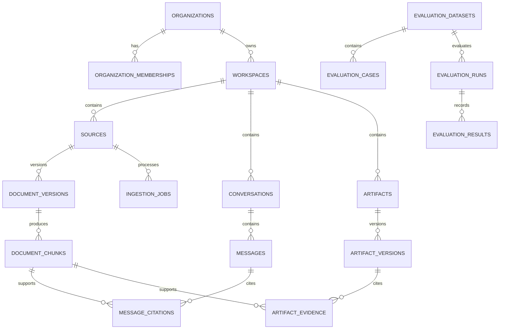

# ClientAtlas V1 Data Model and RLS Contract

| Field | Value |
| --- | --- |
| Status | Frozen logical design |
| Date | 2026-07-24 |
| Database | Supabase PostgreSQL with pgvector |
| Application ORM | Drizzle |

This document defines the logical schema and authorization invariants. Executable
Drizzle migrations become the implementation source of truth, but may not weaken
the constraints defined here without an RFC amendment.

## 1. Schema conventions

- Supabase Auth owns `auth.users`.
- Application tables live in an `app` schema.
- Primary keys are UUIDs generated by the database.
- Timestamps are `timestamptz` in UTC.
- Every tenant-owned row stores `organization_id`.
- Every workspace-owned row stores both `organization_id` and `workspace_id`.
- Composite foreign keys prevent a workspace or child record from being paired
  with the wrong organization.
- User-visible records use explicit lifecycle states rather than relying on
  nullable timestamps alone.
- Original document content is not duplicated into logs or audit-event details.
- All tenant tables enable and force RLS.

## 2. Enumerations

| Enum | Values |
| --- | --- |
| `organization_role` | `owner`, `admin`, `editor`, `viewer` |
| `source_type` | `upload`, `google_drive` |
| `source_status` | `pending`, `ready`, `failed`, `deleting`, `deleted` |
| `ingestion_status` | `queued`, `parsing`, `chunking`, `embedding`, `ready`, `failed`, `deleting`, `deleted` |
| `message_role` | `user`, `assistant` |
| `answer_status` | `complete`, `abstained`, `failed`, `cancelled` |
| `artifact_type` | `onboarding_brief`, `readiness_report`, `action_plan` |
| `artifact_status` | `draft`, `reviewed`, `approved`, `archived` |
| `evaluation_case_type` | `answerable`, `unanswerable`, `contradictory`, `prompt_injection`, `tenant_isolation` |
| `evaluation_run_status` | `queued`, `running`, `passed`, `failed`, `cancelled` |

## 3. Entity relationships



## 4. Core tables

### 4.1 `app.organizations`

| Column | Type | Constraints |
| --- | --- | --- |
| `id` | uuid | PK |
| `name` | text | not null |
| `slug` | text | not null, unique, normalized |
| `created_by` | uuid | not null, FK `auth.users(id)` |
| `created_at` | timestamptz | not null |
| `updated_at` | timestamptz | not null |

An organization is readable only by a current member. Creation occurs through a
transaction that also creates the owner membership.

### 4.2 `app.organization_memberships`

| Column | Type | Constraints |
| --- | --- | --- |
| `organization_id` | uuid | PK part, FK organizations |
| `user_id` | uuid | PK part, FK `auth.users(id)` |
| `role` | `organization_role` | not null |
| `invited_by` | uuid | nullable, FK `auth.users(id)` |
| `created_at` | timestamptz | not null |
| `updated_at` | timestamptz | not null |

Additional constraints:

- at least one owner must remain;
- owner transfer and last-owner removal occur through controlled transactions;
- authorization reads membership from this table rather than user-editable JWT
  metadata.

Indexes:

- PK `(organization_id, user_id)`
- `(user_id, organization_id)`
- partial/filtered lookup for owners where supported by the migration design

### 4.3 `app.workspaces`

| Column | Type | Constraints |
| --- | --- | --- |
| `id` | uuid | PK |
| `organization_id` | uuid | not null, FK organizations |
| `name` | text | not null |
| `description` | text | nullable |
| `privacy_mode` | text | not null: `local_confidential` or `synthetic_demo` |
| `created_by` | uuid | not null, FK `auth.users(id)` |
| `created_at` | timestamptz | not null |
| `updated_at` | timestamptz | not null |

Constraints and indexes:

- unique `(organization_id, id)` for composite child references
- unique normalized workspace name within an organization if product behavior
  requires it
- index `(organization_id, updated_at desc)`

### 4.4 `app.connector_accounts`

| Column | Type | Constraints |
| --- | --- | --- |
| `id` | uuid | PK |
| `organization_id` | uuid | not null |
| `provider` | text | V1: `google_drive` |
| `external_account_id` | text | not null |
| `display_name` | text | nullable |
| `granted_scopes` | text[] | not null |
| `connected_by` | uuid | not null |
| `created_at` | timestamptz | not null |
| `updated_at` | timestamptz | not null |
| `revoked_at` | timestamptz | nullable |

This user-visible table contains safe connection metadata only.

### 4.4.1 `private.connector_credentials`

| Column | Type | Constraints |
| --- | --- | --- |
| `connector_account_id` | uuid | PK, FK connector accounts |
| `credential_ciphertext` | bytea | not null |
| `credential_key_version` | text | not null |
| `updated_at` | timestamptz | not null |

This table lives outside the application schema. User-runtime roles receive no
schema usage or table privilege for it. Only controlled connector workers can
read credential ciphertext. Application-level encryption keys remain outside
the database.

### 4.5 `app.sources`

Represents one logical uploaded or connected source.

| Column | Type | Constraints |
| --- | --- | --- |
| `id` | uuid | PK |
| `organization_id` | uuid | not null |
| `workspace_id` | uuid | not null |
| `source_type` | `source_type` | not null |
| `connector_account_id` | uuid | nullable |
| `external_file_id` | text | nullable |
| `display_name` | text | not null |
| `mime_type` | text | not null |
| `storage_bucket` | text | nullable |
| `storage_path` | text | nullable |
| `status` | `source_status` | not null |
| `active_version_id` | uuid | nullable, established after version table |
| `created_by` | uuid | not null |
| `created_at` | timestamptz | not null |
| `updated_at` | timestamptz | not null |
| `deleted_at` | timestamptz | nullable |

Constraints:

- composite FK `(organization_id, workspace_id)` to workspaces
- uploaded sources require a private bucket/path
- connected sources require a connector and external file ID
- unique active external file per workspace and connector

Indexes:

- `(organization_id, workspace_id, status)`
- `(organization_id, workspace_id, updated_at desc)`

### 4.6 `app.document_versions`

| Column | Type | Constraints |
| --- | --- | --- |
| `id` | uuid | PK |
| `organization_id` | uuid | not null |
| `workspace_id` | uuid | not null |
| `source_id` | uuid | not null |
| `version_number` | integer | not null, positive |
| `content_checksum` | text | not null |
| `source_modified_at` | timestamptz | nullable |
| `byte_size` | bigint | not null, non-negative |
| `page_or_section_count` | integer | nullable |
| `parser_name` | text | not null |
| `parser_version` | text | not null |
| `chunking_config` | jsonb | not null |
| `embedding_model` | text | not null |
| `created_at` | timestamptz | not null |

Constraints:

- composite FK to source tenant tuple
- unique `(source_id, version_number)`
- unique `(source_id, content_checksum)` to support idempotency

### 4.7 `app.document_chunks`

| Column | Type | Constraints |
| --- | --- | --- |
| `id` | uuid | PK |
| `organization_id` | uuid | not null |
| `workspace_id` | uuid | not null |
| `source_id` | uuid | not null |
| `document_version_id` | uuid | not null |
| `chunk_index` | integer | not null, non-negative |
| `content` | text | not null |
| `token_count` | integer | not null, positive |
| `locator` | jsonb | not null |
| `search_vector` | tsvector | generated/stored from content |
| `embedding` | vector(384) | not null for active indexed chunks |
| `created_at` | timestamptz | not null |

The embedding dimension is fixed by the initial local embedding model and may be
changed only through a versioned migration and full re-index.

Constraints and indexes:

- composite FKs preserve organization/workspace/source/version consistency
- unique `(document_version_id, chunk_index)`
- GIN index on `search_vector`
- pgvector index added only when the corpus size justifies it
- B-tree index
  `(organization_id, workspace_id, document_version_id, chunk_index)`

Retrieval must filter to the source's `active_version_id` and exclude deleting
or deleted sources.

### 4.8 `app.ingestion_jobs`

| Column | Type | Constraints |
| --- | --- | --- |
| `id` | uuid | PK |
| `organization_id` | uuid | not null |
| `workspace_id` | uuid | not null |
| `source_id` | uuid | not null |
| `requested_by` | uuid | not null |
| `status` | `ingestion_status` | not null |
| `attempt_count` | integer | not null, default 0 |
| `max_attempts` | integer | not null |
| `available_at` | timestamptz | not null |
| `claimed_at` | timestamptz | nullable |
| `worker_id` | text | nullable |
| `safe_error_code` | text | nullable |
| `started_at` | timestamptz | nullable |
| `completed_at` | timestamptz | nullable |
| `created_at` | timestamptz | not null |

Job payloads reference durable IDs. They do not store arbitrary SQL, model
instructions, or user-provided Storage paths.

Claiming index:

- `(status, available_at, created_at)` for queued work

### 4.9 `app.conversations`

| Column | Type | Constraints |
| --- | --- | --- |
| `id` | uuid | PK |
| `organization_id` | uuid | not null |
| `workspace_id` | uuid | not null |
| `title` | text | nullable |
| `created_by` | uuid | not null |
| `created_at` | timestamptz | not null |
| `updated_at` | timestamptz | not null |

Index `(organization_id, workspace_id, updated_at desc)`.

### 4.10 `app.messages`

| Column | Type | Constraints |
| --- | --- | --- |
| `id` | uuid | PK |
| `organization_id` | uuid | not null |
| `workspace_id` | uuid | not null |
| `conversation_id` | uuid | not null |
| `role` | `message_role` | not null |
| `content` | text | not null |
| `answer_status` | `answer_status` | nullable for user messages |
| `prompt_version` | text | nullable |
| `model_provider` | text | nullable |
| `model_name` | text | nullable |
| `created_by` | uuid | not null |
| `created_at` | timestamptz | not null |

Messages do not store raw provider credentials, full hidden prompts, or signed
URLs.

### 4.11 `app.message_citations`

| Column | Type | Constraints |
| --- | --- | --- |
| `id` | uuid | PK |
| `organization_id` | uuid | not null |
| `workspace_id` | uuid | not null |
| `message_id` | uuid | not null |
| `chunk_id` | uuid | not null |
| `claim_index` | integer | not null |
| `support_score` | numeric | nullable |
| `created_at` | timestamptz | not null |

Composite FKs ensure that the cited chunk and message belong to the same
organization and workspace. Unique `(message_id, claim_index, chunk_id)`.

### 4.12 `app.artifacts`

| Column | Type | Constraints |
| --- | --- | --- |
| `id` | uuid | PK |
| `organization_id` | uuid | not null |
| `workspace_id` | uuid | not null |
| `type` | `artifact_type` | not null |
| `title` | text | not null |
| `status` | `artifact_status` | not null |
| `review_required` | boolean | not null, default false |
| `current_version_id` | uuid | nullable |
| `created_by` | uuid | not null |
| `created_at` | timestamptz | not null |
| `updated_at` | timestamptz | not null |

### 4.13 `app.artifact_versions`

| Column | Type | Constraints |
| --- | --- | --- |
| `id` | uuid | PK |
| `organization_id` | uuid | not null |
| `workspace_id` | uuid | not null |
| `artifact_id` | uuid | not null |
| `version_number` | integer | not null |
| `content` | jsonb | not null, schema-versioned |
| `schema_version` | text | not null |
| `change_summary` | text | nullable |
| `generated_by_model` | boolean | not null |
| `created_by` | uuid | not null |
| `created_at` | timestamptz | not null |

Unique `(artifact_id, version_number)`.

### 4.14 `app.artifact_evidence`

| Column | Type | Constraints |
| --- | --- | --- |
| `id` | uuid | PK |
| `organization_id` | uuid | not null |
| `workspace_id` | uuid | not null |
| `artifact_version_id` | uuid | not null |
| `json_pointer` | text | not null |
| `chunk_id` | uuid | not null |
| `support_score` | numeric | nullable |
| `created_at` | timestamptz | not null |

`json_pointer` identifies the supported field or claim in the structured artifact.

### 4.15 Evaluation tables

#### `app.evaluation_datasets`

| Column | Type | Constraints |
| --- | --- | --- |
| `id` | uuid | PK |
| `name` | text | not null |
| `version` | text | not null |
| `description` | text | not null |
| `is_frozen` | boolean | not null |
| `created_at` | timestamptz | not null |

Evaluation datasets contain synthetic or explicitly approved material only.
Unique `(name, version)`.

#### `app.evaluation_cases`

| Column | Type | Constraints |
| --- | --- | --- |
| `id` | uuid | PK |
| `dataset_id` | uuid | not null |
| `case_key` | text | not null |
| `case_type` | `evaluation_case_type` | not null |
| `question` | text | not null |
| `expected_answer` | text | nullable |
| `expected_source_keys` | text[] | not null |
| `should_abstain` | boolean | not null |
| `metadata` | jsonb | not null |

Unique `(dataset_id, case_key)`.

#### `app.evaluation_runs`

| Column | Type | Constraints |
| --- | --- | --- |
| `id` | uuid | PK |
| `dataset_id` | uuid | not null |
| `status` | `evaluation_run_status` | not null |
| `configuration` | jsonb | not null |
| `git_commit_sha` | text | not null |
| `started_at` | timestamptz | nullable |
| `completed_at` | timestamptz | nullable |
| `aggregate_metrics` | jsonb | nullable |
| `created_at` | timestamptz | not null |

#### `app.evaluation_results`

| Column | Type | Constraints |
| --- | --- | --- |
| `id` | uuid | PK |
| `run_id` | uuid | not null |
| `case_id` | uuid | not null |
| `passed` | boolean | not null |
| `metrics` | jsonb | not null |
| `safe_failure_code` | text | nullable |
| `created_at` | timestamptz | not null |

Unique `(run_id, case_id)`.

Evaluation tables are not granted to browser or general user-runtime roles.
The internal evaluation runner writes them, and the public demo reads only a
sanitized aggregate report generated from the synthetic dataset.

### 4.16 `app.audit_events`

| Column | Type | Constraints |
| --- | --- | --- |
| `id` | uuid | PK |
| `organization_id` | uuid | nullable for system events |
| `workspace_id` | uuid | nullable |
| `actor_user_id` | uuid | nullable |
| `actor_type` | text | `user`, `worker`, or `system` |
| `event_type` | text | fixed application vocabulary |
| `target_type` | text | fixed application vocabulary |
| `target_id` | uuid | nullable |
| `safe_details` | jsonb | not null |
| `created_at` | timestamptz | not null |

Audit details may contain IDs, state transitions, safe error codes, and counts.
They may not contain document bodies, prompts, completions, JWTs, OAuth tokens,
API keys, signed URLs, or credential ciphertext.

## 5. Tenant-key integrity

Tenant child tables use composite uniqueness and foreign keys. Conceptually:

```sql
alter table app.workspaces
  add constraint workspaces_org_id_id_key
  unique (organization_id, id);

alter table app.sources
  add constraint sources_workspace_tenant_fk
  foreign key (organization_id, workspace_id)
  references app.workspaces (organization_id, id);
```

The same pattern continues through source, version, chunk, conversation,
message, citation, artifact, and evidence relationships. This prevents a valid
child ID from being paired with a different tenant ID even if application code
is wrong.

## 6. RLS policy model

### 6.1 Membership predicate

Policies use current database membership and `auth.uid()`. If a helper function
is required to avoid policy recursion, it must:

- be narrowly scoped;
- be owned by the migration role;
- be `security definer`;
- set `search_path = ''`;
- fully qualify all objects;
- return only a boolean or role value;
- receive the target organization ID as a parameter; and
- grant execute only to the application roles that require it.

Conceptual helper:

```sql
create function app.is_organization_member(target_organization_id uuid)
returns boolean
language sql
stable
security definer
set search_path = ''
as $$
  select exists (
    select 1
    from app.organization_memberships membership
    where membership.organization_id = target_organization_id
      and membership.user_id = auth.uid()
  );
$$;
```

The implementation must be reviewed for ownership and grants before use.

### 6.2 Policy templates

Read policy:

```sql
create policy tenant_read
on app.example
for select
to authenticated
using (app.is_organization_member(organization_id));
```

Editor write policy:

```sql
create policy tenant_editor_write
on app.example
for all
to authenticated
using (
  app.organization_role_for(organization_id)
    in ('owner', 'admin', 'editor')
)
with check (
  app.organization_role_for(organization_id)
    in ('owner', 'admin', 'editor')
);
```

Every `UPDATE` path also has the necessary `SELECT` policy. Destructive
organization-level operations require owner-specific policies or controlled
functions.

### 6.3 Enforcement

Every tenant migration includes:

```sql
alter table app.example enable row level security;
alter table app.example force row level security;
```

Migration tests fail if:

- a tenant table lacks RLS;
- a policy omits the expected application role;
- a runtime role owns a tenant table;
- a runtime role has `BYPASSRLS`;
- an application-visible view is not a security invoker; or
- an unreviewed security-definer function is executable by application roles.

## 7. Runtime role model

| Role | Login | Table owner | Bypass RLS | Purpose |
| --- | --- | --- | --- | --- |
| `authenticated` | No | No | No | Fixed effective user role covered by policies |
| User runtime login | Yes | No | No | Pooled Next.js/FastAPI connection; may assume `authenticated` |
| Worker role/client | Restricted | No | Potentially privileged | Controlled ingestion and cleanup |
| Migration owner | Restricted | Yes | Administrative | Schema, grants, policies, migrations |

Role names are resolved in migrations and environment configuration, never from
request data.

## 8. Storage model

Private bucket: `workspace-sources`.

Path:

```text
<organization_id>/<workspace_id>/<document_id>/<sanitized_filename>
```

The database stores the exact bucket/path tuple. User-facing code does not
construct paths from raw request filenames.

Storage policies and tests cover:

- object listing;
- upload;
- download;
- overwrite;
- deletion; and
- signed URL issuance.

Privileged signed URLs are short-lived capabilities and remain separate from
database RLS.

## 9. Deletion behavior

Deleting a source prevents retrieval immediately by changing source status.
The cleanup operation then removes:

- message and artifact evidence references to its chunks;
- unedited generated drafts whose complete evidence set came from the deleted
  source;
- cached generated results derived from the source;
- the source's chunks and embeddings;
- inactive and active document versions;
- ingestion-job transient details;
- the active Storage object; and
- connector-source mappings.

User-edited or multi-source artifacts are retained as user-authored records,
have affected evidence links removed, and are set to `review_required = true`.
This avoids silently deleting user work while preventing stale evidence from
appearing valid.

Audit events retain safe identifiers and state transitions. Provider backup
expiration is outside the active schema and is not represented as immediate
erasure.
