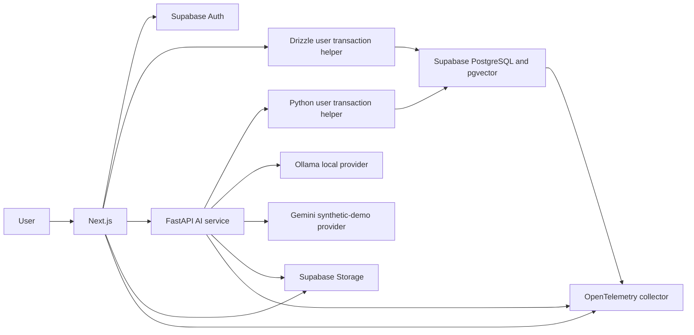

# RFC-001: ClientAtlas V1 Architecture

| Field | Value |
| --- | --- |
| Status | Accepted and frozen |
| Date | 2026-07-24 |
| Owners | Project maintainer |
| Decision scope | V1 application, AI, persistence, security, and deployment |

## 1. Context

ClientAtlas must demonstrate production-oriented full-stack and RAG engineering
without requiring paid infrastructure. The system handles potentially
confidential client material in local mode, exposes a synthetic portfolio demo,
and must make cross-tenant isolation independently testable.

The principal architectural risk is not scale. It is accidentally bypassing
PostgreSQL RLS when Next.js or FastAPI connects directly to Supabase PostgreSQL.
A direct Drizzle or Python database connection does not automatically propagate
the authenticated user's Supabase JWT context.

## 2. Constraints

- Zero mandatory cash cost
- One primary developer
- Next.js, React, TypeScript, Node.js, Drizzle, Python, FastAPI, PostgreSQL, and
  pgvector must be meaningfully represented
- Public hosting has cold starts and no dependable always-on worker
- Confidential content cannot be sent to an unpaid hosted model
- Public demonstration data must be synthetic
- Security tests must prove database, retrieval, and object-storage isolation
- V1 must remain completable within an approximately 8-10 week solo schedule

## 3. Decision

Use a modular web application plus a specialized AI service:



### 3.1 Component responsibilities

#### Next.js

- Render the product interface.
- Manage Supabase Auth browser and server sessions.
- Implement Node.js route handlers for organizations, workspaces, memberships,
  sources, conversations, artifacts, and evaluation metadata.
- Use Drizzle for typed SQL and migrations.
- Stream AI-service responses to the browser.
- Issue object access only after a fresh authorization check.

#### FastAPI

- Validate the same Supabase access tokens as Next.js.
- Parse supported documents.
- Chunk, embed, and index extracted text.
- Execute hybrid retrieval and reciprocal rank fusion.
- Generate answers, citations, onboarding artifacts, and readiness reports.
- Expose model and embedding provider interfaces.
- Emit AI-specific traces and metrics.

FastAPI is not a privileged side door for user queries. Any request performed on
behalf of a user uses the same effective-role and verified-claims database
contract as Next.js.

#### PostgreSQL and pgvector

- Store tenant data, source metadata, extracted chunks, embeddings,
  conversations, citations, artifacts, evaluation metadata, and audit events.
- Enforce tenant isolation through RLS.
- Perform lexical and vector candidate retrieval.
- Record durable ingestion state.

#### Supabase Storage

- Store original PDF and DOCX objects in private buckets.
- Enforce separate Storage policies.
- Return short-lived signed URLs only after authorization.

#### Model providers

- Ollama is the default provider for local confidential mode.
- Gemini's unpaid quota may be used only for the fictional public-demo corpus.
- No automatic fallback from Ollama to Gemini is permitted.

## 4. Authentication and database authorization contract

### 4.1 Token verification

Both Next.js and FastAPI must independently verify:

- the token signature using Supabase JWKS;
- the expected issuer;
- the expected audience;
- expiration and not-before values;
- a non-empty UUID subject; and
- the expected authenticated role.

Only the server-generated `VerifiedClaims` value may enter the database
transaction helper. Raw request headers, decoded-but-unverified payloads, and
client-provided organization IDs are not authorization evidence.

Organization membership remains in PostgreSQL. It is not trusted from
user-editable JWT metadata.

### 4.2 Effective role and claims

JWT claims and the effective PostgreSQL role are separate controls. Policies
declared `TO authenticated` do not run merely because
`request.jwt.claims` exists. The transaction must also run under
`authenticated`, or under a custom role explicitly covered by every policy.

V1 uses the fixed `authenticated` role:

```ts
export async function withUserDatabase<T>(
  verifiedClaims: VerifiedClaims,
  operation: (tx: UserTransaction) => Promise<T>,
): Promise<T> {
  return db.transaction(async (tx) => {
    await tx.execute(
      sql`select set_config(
        'request.jwt.claims',
        ${JSON.stringify(verifiedClaims)},
        true
      )`,
    );

    // This identifier is a fixed code constant, never request input.
    await tx.execute(sql`set local role authenticated`);

    return operation(tx);
  });
}
```

Rules:

1. Claims and queries execute inside the same transaction.
2. `set_config(..., true)` and `SET LOCAL` prevent state leaking into a reused
   pooled connection.
3. The login role is granted only the ability required to assume the fixed
   application role.
4. The login role is `NOBYPASSRLS` and does not own application tables.
5. All user-scoped database helpers require a `VerifiedClaims` type that cannot
   be instantiated by route input parsing.
6. SQL values are parameterized. SQL identifiers, role names, and configuration
   keys are fixed constants.
7. Route handlers cannot import migration or worker database clients.

### 4.3 Python parity

FastAPI provides an equivalent helper:

```python
async def with_user_database(
    verified_claims: VerifiedClaims,
    operation: Callable[[AsyncSession], Awaitable[T]],
) -> T:
    async with user_session_factory() as session:
        async with session.begin():
            await session.execute(
                text(
                    "select set_config("
                    "'request.jwt.claims', :claims_json, true)"
                ),
                {"claims_json": verified_claims.model_dump_json()},
            )
            # Fixed SQL constant; no request-derived identifier.
            await session.execute(text("set local role authenticated"))
            return await operation(session)
```

The actual implementation must ensure the callback cannot retain the session
outside the transaction. Tests must demonstrate that claims and roles are reset
when pooled connections are reused by different users.

### 4.4 Credential separation

| Credential | Purpose | RLS behavior | Import boundary |
| --- | --- | --- | --- |
| User runtime login | Next.js and FastAPI user work | Must obey RLS | User transaction modules only |
| Worker/service credential | Controlled ingestion and cleanup | May bypass RLS | Worker process only |
| Migration credential | Schema and policy migrations | Administrative | CLI/CI migration job only |
| Browser publishable key | Auth and permitted Storage/Data API calls | User JWT policies | Browser client only |

The service-role client:

- is created in a dedicated worker-only module;
- never reads request cookies or Authorization headers;
- is unavailable to browser bundles and route-handler dependency graphs;
- requires explicit `organization_id`, `workspace_id`, and job ID arguments;
- records privileged operations in the audit log; and
- cannot mint arbitrary long-lived signed object URLs.

### 4.5 RLS hardening

Every tenant-owned table:

```sql
alter table app.example enable row level security;
alter table app.example force row level security;
```

Additional invariants:

- application runtime roles do not own tenant tables;
- table ownership remains with the migration owner;
- application roles are `NOBYPASSRLS`;
- views use `security_invoker = true` or are inaccessible to application roles;
- security-definer functions use a fixed empty `search_path`, fully qualified
  names, minimal grants, and focused tests; and
- all tenant tables have both organization-aware indexes and policies.

`FORCE ROW LEVEL SECURITY` protects against accidental execution as a table
owner. It does not constrain a superuser or a role with `BYPASSRLS`; credential
separation remains mandatory.

## 5. Storage authorization contract

Database RLS and Supabase Storage policies are separate boundaries.

V1 uses:

- a private `workspace-sources` bucket;
- object paths shaped as
  `<organization_id>/<workspace_id>/<document_id>/<safe_filename>`;
- Storage policies that validate membership for user operations;
- a fresh database membership check before the server creates a signed URL;
- signed URLs with the shortest practical TTL;
- no signed URLs in logs, traces, analytics, or persistent messages; and
- deletion of the active object before marking a deletion job complete.

Privileged workers can access objects for ingestion, but they must validate the
job's stored organization, workspace, document, and object path tuple. They may
not accept an arbitrary object path from a user request.

Security tests must prove that one tenant cannot list, download, overwrite,
delete, or obtain a usable signed URL for another tenant's object.

## 6. Data ownership and service boundaries

The same physical PostgreSQL database is used by Next.js and FastAPI. Logical
ownership is separated:

| Area | Primary writer |
| --- | --- |
| Organizations, memberships, workspaces | Next.js |
| Source metadata and ingestion requests | Next.js |
| Extracted chunks and embeddings | FastAPI worker |
| Conversations and messages | Next.js |
| Retrieval candidates and citations | FastAPI |
| Artifact metadata and user edits | Next.js |
| Generated artifact drafts and evidence | FastAPI |
| Evaluation definitions | Repository seed plus Next.js |
| Evaluation results | FastAPI evaluation runner |

Neither service receives exclusive trust. RLS and explicit credentials remain
the security boundary.

## 7. Ingestion design

V1 stores ingestion work in PostgreSQL rather than requiring Redis:

1. Next.js validates authorization and creates a document and queued job.
2. The local worker claims a queued job with `FOR UPDATE SKIP LOCKED`.
3. The worker transitions through parsing, chunking, and embedding.
4. A checksum and source version make processing idempotent.
5. Chunks for a new version are written before that version becomes active.
6. The active version switches in one transaction.
7. Failed work records a safe code, attempt count, and retry eligibility.

The public demo does not depend on this worker. It is pre-seeded and read-only.

Revisit Redis or a durable hosted queue only when concurrent ingestion, worker
contention, or measured job latency exceeds the PostgreSQL design.

## 8. Retrieval and answer flow

1. Validate the user JWT and workspace access.
2. Normalize the question without adding unsupported intent.
3. Execute lexical and vector retrieval with mandatory organization, workspace,
   active-version, and deletion filters.
4. Retrieve independent candidate lists.
5. Fuse ranks using reciprocal rank fusion.
6. Select a bounded evidence set.
7. Treat retrieved text as quoted, untrusted data.
8. Generate a structured answer containing claims and source references.
9. Validate referenced chunk IDs against the retrieved set and current tenant.
10. Stream validated answer events.
11. Abstain if evidence is missing, contradictory, or below the configured
    threshold.
12. Store final message and citations only after validation.

Reranking is deferred until evaluation shows that reciprocal rank fusion cannot
meet the retrieval target.

## 9. Prompt-injection boundary

Documents and questions cannot:

- alter system instructions;
- request secrets, credentials, or cross-workspace data;
- trigger connector, deletion, or administrative actions;
- redefine citation IDs;
- select a different model-provider privacy mode; or
- disable authorization and output validation.

The model receives clearly delimited evidence and no privileged tools in V1.
Output is schema-validated, and citations must reference the retrieved
allowlist.

## 10. Deletion semantics

The product promise is:

> Deleting a source removes it from active object storage and removes associated
> application records, extracted content, chunks, embeddings, cached results,
> and generated artifacts. Infrastructure-provider retention and backup
> expiration remain subject to the provider's documented policies.

For this promise, "generated artifacts" means unedited generated drafts whose
complete evidence set came from the deleted source. User-edited or multi-source
artifacts remain as user-authored records, lose affected evidence links, and are
marked for review.

Deletion is a stateful, auditable operation:

1. mark the source `deleting`;
2. prevent new retrieval;
3. remove derived database records;
4. remove the active Storage object;
5. invalidate cached and signed access where possible;
6. record a safe completion event; and
7. mark the source deleted without claiming immediate provider-backup erasure.

## 11. Deployment

### Local

- Docker Compose for Next.js, FastAPI, PostgreSQL/pgvector, Ollama,
  OpenTelemetry Collector, Prometheus, and Grafana
- Supabase local development may replace the standalone PostgreSQL container
  when Auth and Storage behavior is under test
- Real upload, OAuth, worker, re-indexing, and deletion demonstrations

### Public

- Next.js on a free personal-project host
- FastAPI on a free sleeping web-service host
- Supabase Free for Auth, PostgreSQL, pgvector, and Storage
- Seeded fictional corpus
- Read-only anonymous product path
- Gemini unpaid quota only for synthetic content
- No uptime, durability, confidentiality, or enterprise-capacity claim

## 12. Observability

OpenTelemetry trace boundaries:

- HTTP request
- token verification
- user database transaction
- Storage authorization
- document parsing
- chunking
- embedding
- lexical retrieval
- vector retrieval
- rank fusion
- model generation
- citation validation
- artifact generation

Telemetry records identifiers suitable for correlation, not document bodies,
prompts, completions, JWTs, OAuth credentials, API keys, or signed URLs.

Local dashboards show:

- p50 and p95 request and generation latency;
- time to first streamed token;
- ingestion queue depth, attempts, duration, and failures;
- lexical/vector candidate counts;
- abstention and invalid-citation counts;
- provider request and token counts; and
- evaluation metrics by version.

## 13. Options considered

| Option | Decision | Rationale |
| --- | --- | --- |
| Separate NestJS product API | Deferred | Adds a deployed service without improving V1 boundaries |
| Supabase Data API for all user queries | Rejected as sole path | Safe RLS propagation, but loses the intended Drizzle runtime experience |
| Drizzle with owner connection | Rejected | Can undermine RLS and collapses credential separation |
| Drizzle with verified claims and fixed role | Accepted | Preserves TypeScript/Drizzle experience and makes RLS explicit |
| Redis queue | Deferred | PostgreSQL job claiming is sufficient for local V1 |
| Azure deployment | Deferred | Violates the strict zero-cost constraint |
| Hosted LLM for all content | Rejected | Unpaid-service privacy is unsuitable for confidential client data |
| Local model plus synthetic hosted demo | Accepted | Preserves privacy while allowing a public portfolio experience |
| Vector-only retrieval | Rejected | Misses exact terms, names, codes, and identifiers |
| Hybrid retrieval with RRF | Accepted | Simple, testable, and requires no paid reranker |

## 14. Consequences

### Positive

- The system demonstrates Node.js, TypeScript, Drizzle, PostgreSQL, Python, RAG,
  security, evaluation, and observability.
- RLS is an enforced database contract instead of an application convention.
- Local confidential mode remains independent of paid providers.
- The public demo can remain zero cost and narrowly controlled.

### Negative

- User database access requires carefully duplicated helpers in TypeScript and
  Python.
- Free public hosting has cold starts and no production SLA.
- PostgreSQL jobs are less capable than a dedicated queue.
- Local LLM quality and latency depend on developer hardware.

### Mitigations

- Contract tests run against both transaction helpers.
- The UI makes cold starts and demo limitations explicit.
- Queue behavior is isolated behind a worker interface.
- Evaluation results are recorded per provider and hardware profile.

## 15. Revisit triggers

Amend this RFC when:

- PostgreSQL job claiming cannot meet measured concurrency needs;
- retrieval Recall@10 remains below target after chunking and RRF tuning;
- a second connector is accepted into scope;
- the application begins handling non-synthetic hosted client data;
- paid infrastructure becomes available;
- more than one independent team owns services; or
- a security test demonstrates that the shared transaction contract is
  insufficient.
