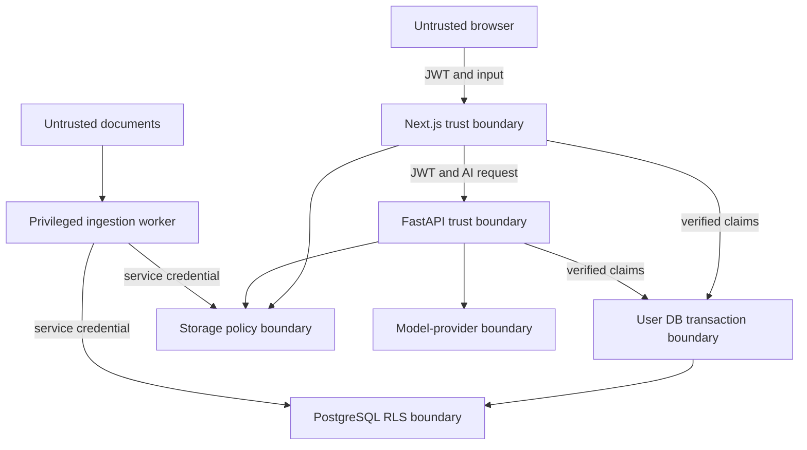

# ClientAtlas V1 Threat Model

| Field | Value |
| --- | --- |
| Status | Frozen baseline |
| Date | 2026-07-24 |
| Method | Asset and trust-boundary review with STRIDE-style threat enumeration |
| Applies to | Local confidential mode and synthetic public demo |

## 1. Security objectives

1. A user cannot read or modify another organization's database rows or stored
   objects.
2. A retrieved document cannot override application policy or authorize an
   action.
3. Unverified identity claims never enter the database authorization context.
4. Privileged credentials cannot enter browser or user-request lifecycles.
5. Confidential content remains local unless the user explicitly selects an
   approved provider mode.
6. Generated claims are traceable to evidence or marked unsupported.
7. Deletion claims describe active-system behavior accurately without
   overpromising provider-backup erasure.

## 2. Assets

### High sensitivity

- Uploaded client files and extracted text
- Embeddings derived from client content
- Google OAuth refresh tokens
- Supabase access and refresh tokens
- Service-role, database, model-provider, and encryption credentials
- Signed object URLs

### Business sensitivity

- Organization memberships and roles
- Workspaces, conversations, onboarding briefs, and action plans
- Readiness reports, risks, contradictions, and missing-information findings
- Evaluation cases derived from user failures
- Audit trails

### Integrity-critical

- RLS policies and database roles
- Verified-claims transaction helpers
- Source-to-chunk and citation mappings
- Prompt versions, provider configuration, and evaluation results
- Ingestion and deletion state machines

## 3. Trust boundaries

Key assumptions:

- Browser state, request parameters, uploaded documents, OAuth source content,
  and model output are untrusted.
- Next.js and FastAPI are trusted to verify tokens correctly but are not trusted
  to replace database authorization.
- The privileged worker is trusted with service credentials but receives only
  durable job identifiers, not arbitrary user-supplied paths or SQL.
- External free-tier providers are outside the confidential-data boundary.

## 4. Roles and attackers

- Legitimate organization owner, admin, editor, or viewer
- Authenticated malicious tenant
- Unauthenticated internet user
- Malicious uploaded-document author
- Attacker with a stolen user token
- Attacker who discovers a signed Storage URL
- Dependency or CI supply-chain attacker
- Developer accidentally using migration or service credentials at runtime
- Model provider or free-tier infrastructure operator

## 5. Threat register

| ID | Threat | Impact | Primary controls | Verification |
| --- | --- | --- | --- | --- |
| TM-001 | Route changes `organization_id` to another tenant | Cross-tenant disclosure or modification | RLS membership policies; composite tenant FKs; no authorization from request IDs | Same request as tenant A and tenant B; B receives no rows |
| TM-002 | Vector query omits tenant filter | Semantic cross-tenant leakage | RLS on chunks; mandatory org/workspace predicates; retrieval helper owns query | Deterministic seeded near-duplicate chunks across tenants |
| TM-003 | Full-text query omits tenant filter | Exact-text cross-tenant leakage | Same controls as TM-002 | Search unique canary terms belonging to another tenant |
| TM-004 | Drizzle direct connection runs as owner or bypass role | Complete RLS bypass | Non-owner `NOBYPASSRLS` login; fixed role; `FORCE RLS`; credential linting | Inspect role attributes; negative integration test |
| TM-005 | Verified claims are set but effective role is not | Policies `TO authenticated` do not apply as intended | One transaction helper sets claims and `SET LOCAL ROLE authenticated` | Assert `current_role`, `auth.uid()`, and visible rows |
| TM-006 | Role or claims leak through pooled connection reuse | User B inherits user A context | `set_config(..., true)`; `SET LOCAL`; same transaction; pool-reuse test | Alternate two users repeatedly on a one-connection pool |
| TM-007 | Attacker supplies forged or decoded-only JWT claims | Identity spoofing | JWKS signature, issuer, audience, expiry, nbf, subject validation; branded `VerifiedClaims` type | Forged, expired, wrong-audience, and wrong-issuer tokens |
| TM-008 | Service-role client enters route-handler lifecycle | RLS bypass through user request | Separate module and environment variable; dependency-boundary lint; no cookie sharing | Build-time import test and runtime credential assertion |
| TM-009 | Worker accepts arbitrary tenant or Storage path | Privileged cross-tenant object access | Worker loads tuple from durable job; validates source/document relationship; audit event | Tampered job and mismatched object-path tests |
| TM-010 | Signed URL exposes another tenant's object | Confidential file disclosure | Fresh membership check; private bucket; short TTL; no logging; object-path validation | Cross-tenant create/download/list/delete URL tests |
| TM-011 | Signed URL remains useful after access revocation | Residual disclosure until expiry | Short TTL; no persistent storage of URLs; re-check before minting | Revoke membership and verify no new URL; measure old TTL |
| TM-012 | Malicious PDF/DOCX exploits parser | Code execution or resource exhaustion | MIME detection; parser isolation; size/page/time limits; no macros; updated parsers | Corrupt, oversized, archive-bomb, and timeout fixtures |
| TM-013 | Document contains prompt injection | Secret disclosure, policy override, false output | Evidence treated as untrusted; no privileged tools; structured output; allowlisted citations | Direct and indirect injection evaluation cases |
| TM-014 | Model invents or swaps citations | Misleading onboarding decisions | Citation IDs restricted to retrieved set; post-generation validator; abstention | Invalid, wrong-tenant, and unsupported citation fixtures |
| TM-015 | User prompt attempts model/provider switch | Confidential data sent to unpaid service | Provider policy chosen server-side from workspace mode; no automatic fallback | Request-injected provider fields are rejected |
| TM-016 | Gemini receives real client material | Privacy breach | Synthetic-only hosted corpus; public upload disabled; provider-mode banner | Data-classification test and synthetic corpus manifest |
| TM-017 | OAuth refresh token leaks from DB/logs | Drive account compromise | Application-level encryption; worker-only decrypt; log redaction; least-privilege scope | Secret scanning and trace/log inspection |
| TM-018 | OAuth callback is forged | Account-link takeover | State and PKCE where supported; exact redirect URI; one-time code exchange | Missing, reused, and mismatched state tests |
| TM-019 | SQL, command, or path injection | Data loss or code execution | Schema validation; parameterized SQL; fixed role/identifier SQL; safe filenames | Injection payload suite |
| TM-020 | HTML or Markdown output causes XSS | Session or content theft | Safe Markdown renderer; HTML disabled or sanitized; CSP; escaped filenames | Stored and reflected XSS fixtures |
| TM-021 | Large inputs or repeated model requests exhaust free quota | Demo denial of service | File limits; per-user/IP rate limit; bounded retrieval; request and token ceilings | Rate-limit and maximum-size tests |
| TM-022 | Logs or traces capture content or credentials | Secondary disclosure | Attribute allowlist; redaction; no prompt/body capture; safe error codes | Automated telemetry snapshot assertions |
| TM-023 | Deletion leaves active derived data | Continued retrieval after deletion | Deleting state blocks retrieval; cascade/cleanup job; completion checks | Search canary before and after deletion |
| TM-024 | Product promises provider-backup erasure | Misrepresentation and compliance risk | Exact deletion statement; documented provider retention limitation | Documentation acceptance review |
| TM-025 | Dependency or CI compromise steals secrets | Repository or deployment compromise | Lockfiles; dependency review; least-privilege CI; no secrets in fork jobs | Secret scan, dependency audit, workflow permission review |
| TM-026 | Stale JWT retains removed membership metadata | Continued access | Membership checked in DB for every request; JWT subject only identifies user | Remove membership without refreshing token |
| TM-027 | Security-definer helper has mutable search path | Privilege escalation | Empty fixed `search_path`; fully qualified objects; minimal execute grants | Migration static check and malicious shadow-object test |
| TM-028 | View bypasses underlying RLS | Cross-tenant row disclosure | `security_invoker = true` or revoke application access | Enumerate views and run tenant canary tests |

## 6. Authorization rules

### Organization roles

| Capability | Owner | Admin | Editor | Viewer |
| --- | --- | --- | --- | --- |
| Read workspace content | Yes | Yes | Yes | Yes |
| Upload and re-index | Yes | Yes | Yes | No |
| Ask questions and create drafts | Yes | Yes | Yes | Yes |
| Edit shared artifacts | Yes | Yes | Yes | No |
| Manage members | Yes | Yes, except owner transfer | No | No |
| Delete workspace or organization | Yes | No | No | No |
| Link or revoke connectors | Yes | Yes | No | No |

Policies evaluate current database membership. Organization authorization data is
not accepted from `raw_user_meta_data`.

## 7. Storage-specific rules

- Buckets containing workspace documents are private.
- Object paths are server-generated from validated UUIDs and a sanitized display
  filename.
- Original filenames are metadata, not trusted path fragments.
- Signed URLs are capabilities: anyone possessing one may use it until expiry.
- A privileged worker may mint a URL only for its current durable job.
- User-facing signed URLs require a fresh membership check and minimal TTL.
- Signed URLs never appear in persistent messages, artifacts, audit details,
  error payloads, or telemetry.
- Database RLS success does not count as Storage authorization evidence.

## 8. AI-specific controls

### Input

- Separate system policy, user question, and retrieved evidence.
- Label evidence as untrusted quoted material.
- Limit evidence count, length, source types, and tenant scope.
- Reject unsupported model/provider override fields.

### Output

- Require a versioned JSON schema for answers and artifacts.
- Reject citation IDs outside the retrieved allowlist.
- Reject tenant, workspace, or document IDs outside the authorized context.
- Render model output as sanitized content, never executable HTML.
- Prefer abstention when evidence does not support a claim.

### No-tools rule

The V1 model has no connector, deletion, membership, shell, database, email, or
web-browsing tool. Application code performs retrieval before generation.

## 9. File-processing controls

- Accept PDF and DOCX only.
- Enforce conservative file and extracted-text limits.
- Detect MIME independently of extension.
- Reject encrypted, macro-enabled, or unsupported compound documents.
- Disable external entity resolution and outbound network access in parsers.
- Bound CPU time, memory, pages, archive entries, and decompressed size.
- Store parser failure details internally and return safe error codes.
- Treat extracted links and instructions as content, not actions.

## 10. Security verification matrix

| Suite | Required evidence |
| --- | --- |
| JWT validation | Forged, expired, not-yet-valid, wrong issuer, wrong audience |
| Role/claims helper | Correct `current_role`, `auth.uid()`, rollback, pool reuse |
| Database tenancy | CRUD denial across every tenant table |
| Retrieval tenancy | Lexical and vector canary isolation |
| Storage tenancy | List, upload, download, overwrite, delete, and signed URL denial |
| Privileged worker | Mismatched tenant/path/job rejection |
| Prompt injection | Direct and document-borne adversarial cases |
| Citation integrity | Retrieved allowlist and support checks |
| File safety | Corrupt, oversized, mislabeled, macro, and decompression fixtures |
| Rate limits | Per-user and anonymous quota enforcement |
| Telemetry hygiene | No secrets or source content in captured spans/logs |
| Deletion | No active object, chunks, embeddings, citations, or retrieval after completion |

Security suites run in CI with deterministic fixtures. LLM nondeterminism cannot
be used to decide whether tenant isolation passed.

## 11. Data handling and retention

- Synthetic public-demo data is clearly labeled and reproducible from repository
  seeds.
- Local confidential data remains on the user's machine when the lightweight
  Hugging Face mode is selected.
- OAuth tokens are encrypted at the application layer and excluded from
  exports.
- Evaluation fixtures cannot be created from confidential production failures
  without deliberate redaction and approval.
- Active-system deletion is verified; provider backup expiration is documented,
  not promised.

## 12. Incident response

If tenant leakage, credential exposure, or confidential provider routing is
suspected:

1. disable affected public routes and connector operations;
2. rotate service, database, OAuth, and provider credentials as applicable;
3. preserve safe audit metadata without copying sensitive content;
4. identify affected organizations, sources, and time windows;
5. patch the deterministic regression test before reopening the path;
6. rerun the full cross-tenant and provider-routing suites; and
7. document root cause and corrective controls.

## 13. Residual risks accepted for V1

- Free public hosting can be unavailable or lose ephemeral runtime state.
- A previously issued signed URL remains usable until its short TTL expires.
- Local model quality depends on available hardware.
- Free providers may change quotas or terms.
- Provider backups may retain deleted data for their documented retention
  periods.
- The public demo is not suitable for real client data or commercial production
  use.
